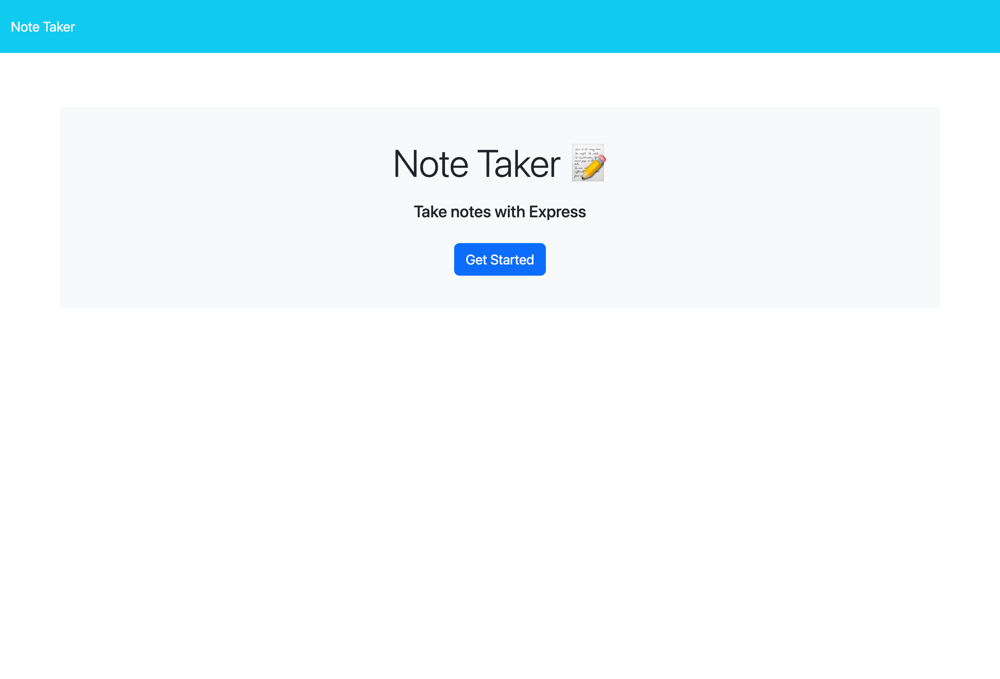
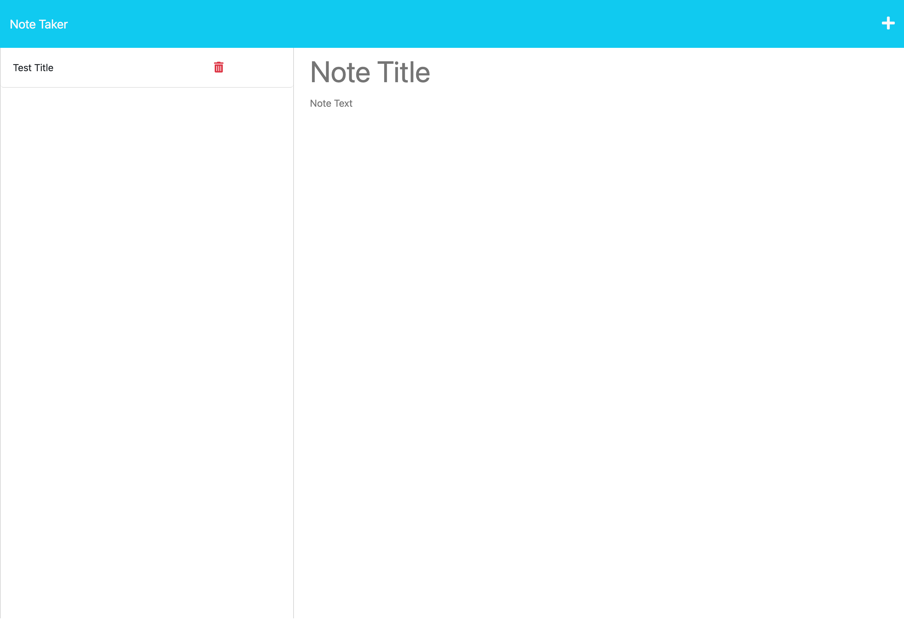

# Note Taker

## Description
A note taker that can be used to write and save notes.

## Usage

To use this application, click "Get Started." Once you have navigated to the notes page, enter your note title and note text in the corresponding fields. You can delete the notes that you have added by clicking the red trash can located on the right side of your note once it is saved. 

Link to the [deployed application](https://young-beach-27029-886e8f5a65a5.herokuapp.com/). 

Screenshots of deployed application:

## Credits

I received starter code for this application from this [GitHub repository](https://github.com/coding-boot-camp/miniature-eureka.git). I also received support from a tutor.  

## License

Please refer to the LICENSE in the repo.
